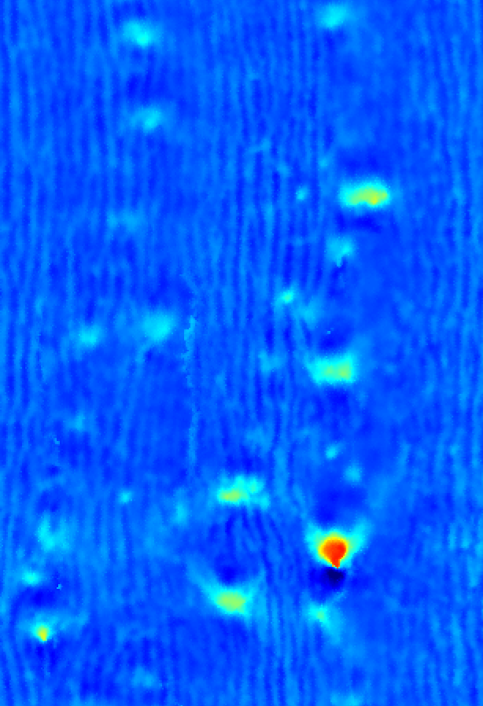

# mapLog

  
  

This GitHub repository contains code for generating 2D maps representing the surface of a tree. Specifically, a discrete structure allows mapping between 3D points and image pixels. A multi-resolution analysis is applied to the image so that, even if the point density in the cloud is low, the generated image does not have gaps.
## Dependencies

## Use

